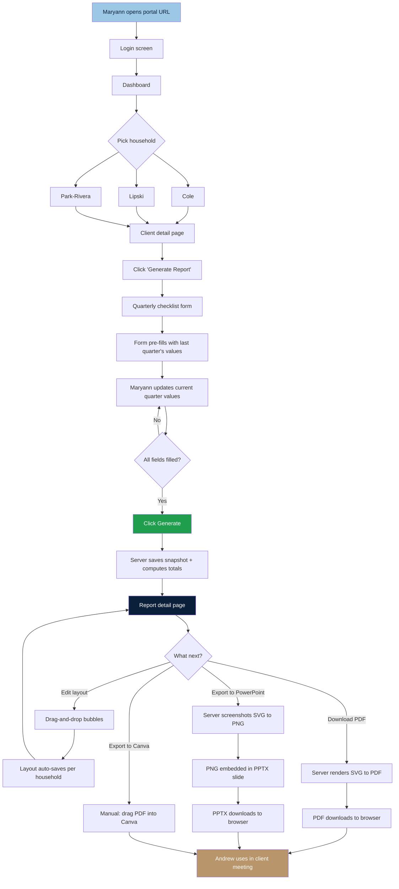
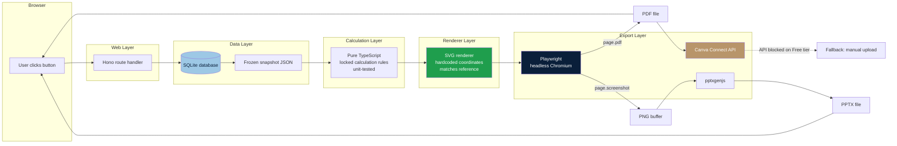
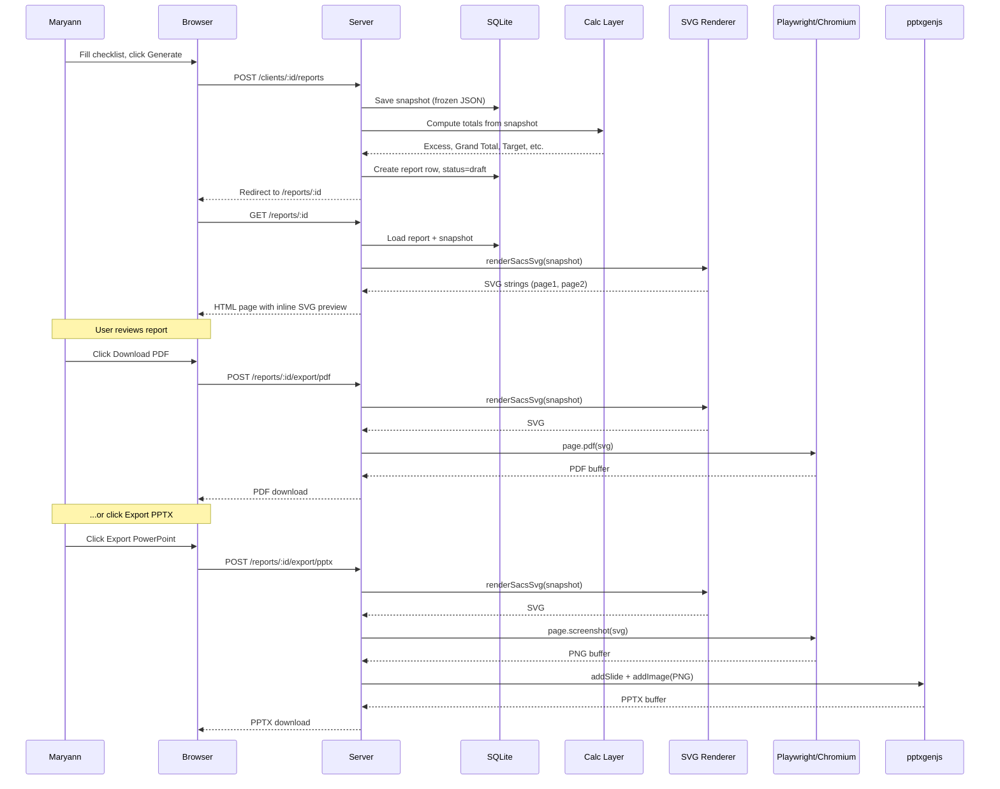
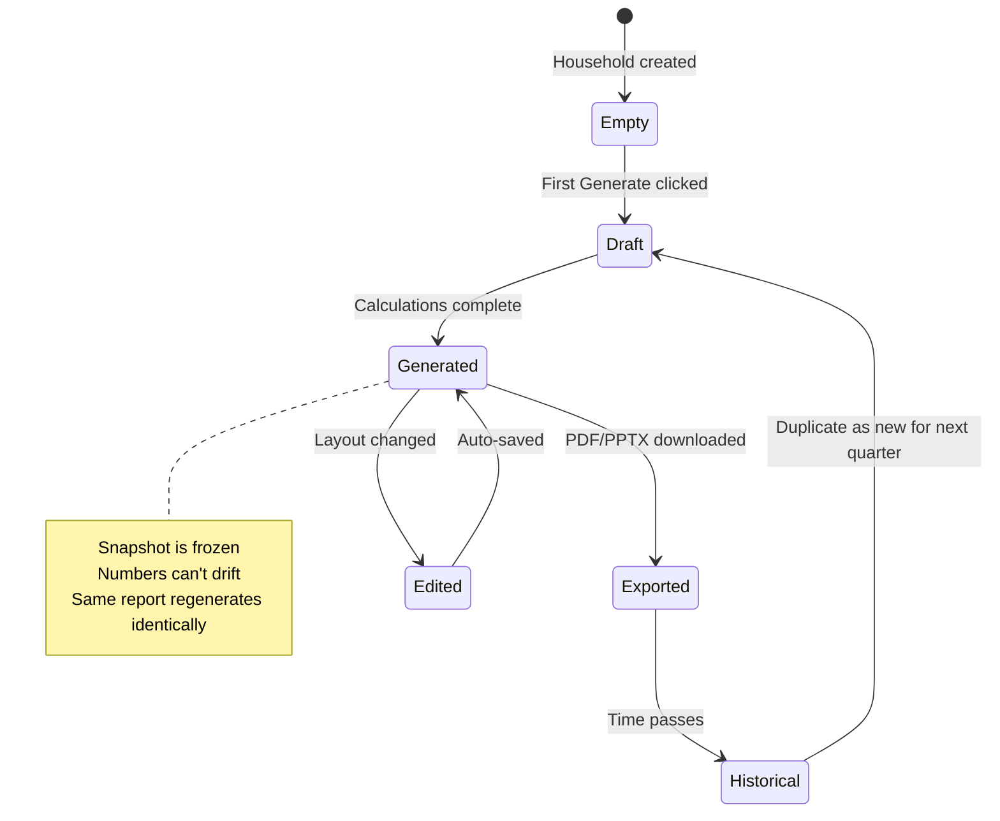

# Windbrook Portal — App Flow

## High-level user flow (the path Maryann takes)

## System architecture (what happens behind a click)

## Report generation pipeline (the core sequence)

## Data state transitions

